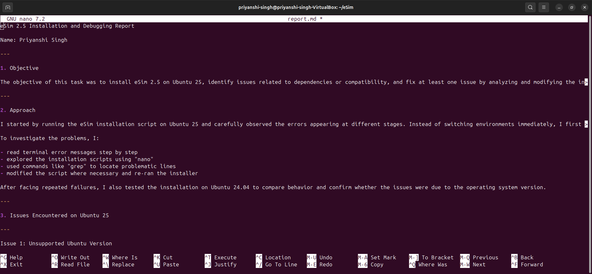
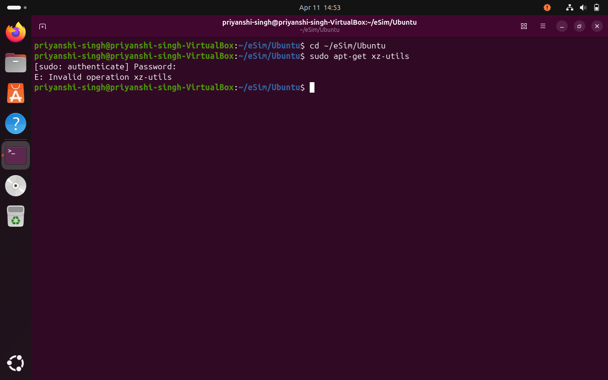
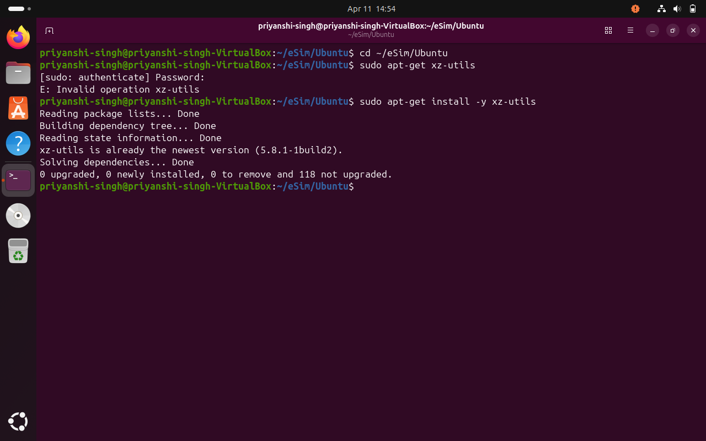
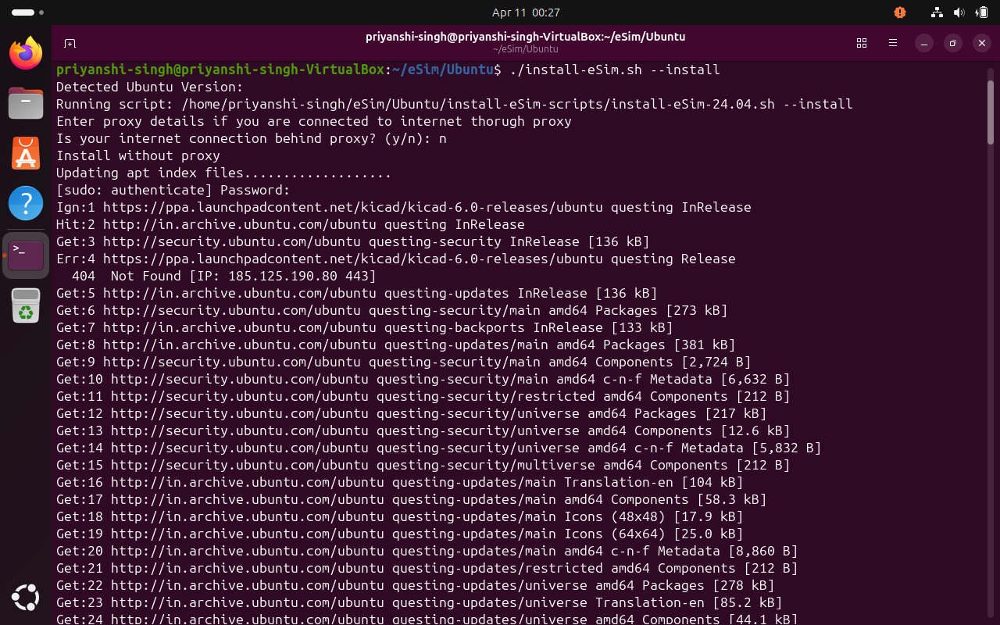
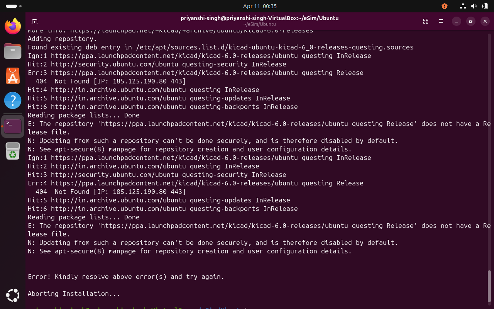

               eSim 2.5 Installation and Debugging Report

1. Objective

The objective of this task was to install eSim 2.5 on Ubuntu 25.04, identify issues related to dependencies or compatibility, and fix at least one issue by analyzing and modifying the 
installation scripts.

2. Approach

I started by running the eSim installation script on Ubuntu 25.04 and carefully observed the errors appearing at different stages. Instead of switching environments immediately, I
first tried to understand each issue properly.

To investigate the problems, I:

- read terminal error messages step by step
- explored the installation scripts using "nano"
- used commands like "grep" to locate problematic lines
- modified the script where necessary and re-ran the installer
- I referred to terminal logs, documentation, and online resources to understand and resolve errors.

After facing repeated failures, I also tested the installation on Ubuntu 24.04 to compare behavior and confirm whether the issues were due to the operating system version.

3. Methodology

The debugging process was carried out step-by-step:
- Installed eSim 2.5 on Ubuntu 25.04
- Observed errors during installation
- Identified failing steps from terminal output
- Inspected installation scripts to locate issues
- Applied fixes and tested again
- Compared behavior with Ubuntu 24.04 for verification
- In cases where certain steps repeatedly failed, those parts of the script can be commented out to continue debugging further stages of installation.

4. **Issues Encountered on Ubuntu 25**

Several issues were encountered during installation on Ubuntu 25.04. The most critical ones are discussed below:

#Issue 1: Incorrect Handling of Ubuntu 25.04 Version

Error Observed:
While running the installer on Ubuntu 25.04, no direct error message related to the version was shown. However, during execution, the installation did not behave as expected, which
made me suspect that the version might not be handled properly.

### Screenshots of error observed:

Investigation:
To understand this, I checked the install-eSim.sh script and searched for how the Ubuntu version is being handled using:
    grep -i "VERSION_ID" install-eSim.sh

After going through the script, I found that a case statement is used to decide which installation script should run based on the Ubuntu version.

Analysis:
While reading the case block, I noticed that versions starting with "25." are not handled separately. Instead, they are redirected to use the Ubuntu 24.04 installation script:

    "25."*)
        SCRIPT="$SCRIPT_DIR/install-eSim-24.04.sh"

This means that even though I was using Ubuntu 25.04, the script was treating it as Ubuntu 24.04. This might work partially, but it can also cause compatibility issues since newer
versions may have different dependencies or behaviors.

Conclusion:
From this, I understood that the script does not truly support Ubuntu 25.xx. It just maps it to an older version, which is not a reliable solution. A better approach would be to
either add proper support for newer versions or avoid strict version mapping and instead check for required dependencies directly.

#Issue 2: Incorrect apt-get Command (Fixed)

Error Observed:
    “E: Invalid operation xz-utils”

### Screenshots of error observed:

### After fixing the command:

Investigation:
To locate the issue, I used:
    grep -rn "xz-utils" .

The issue was identified by inspecting the relevant installation script using:
    nano install-eSim-scripts/install-eSim-24.04.sh

Although the issue was minor syntactically, it caused the installation process to fail at an early stage, making it a critical blocking error.
This allowed me to trace the incorrect command within the script and confirm the source of the error.

Analysis:
The command is incorrect because "apt-get" requires the "install" keyword before specifying the package name. This type of syntax error indicates that the script lacks validation or
testing for command correctness, which can break the entire installation process even for a small mistake.

The original command in the script was:
    sudo apt-get xz-utils

Fix Applied:
I corrected the command to:

    sudo apt-get install -y xz-utils

Verification:
After correcting the command and re-running the installer, the error was resolved and the installation progressed further. This confirmed that the issue was due to incorrect command
syntax rather than a deeper dependency problem.

#Issue 3: KiCad Repository (PPA) Error

Error Observed:
    404 Not Found – repository does not have a Release file

### Screenshots of error observed

The following screenshots show the exact error encountered during installation:

Investigation:
While running-
    sudo apt update

I observed that the KiCad repository returned a 404 error and did not support the Ubuntu 25 codename.

Analysis:
The installer assumes availability of the KiCad PPA, but it does not provide packages for newer Ubuntu versions.

Conclusion:
This is an external compatibility issue rather than a direct bug in the script. However, the installer assumes availability of the repository without validation. A better design
would include checks for repository support or fallback mechanisms to prevent complete failure.

#Issue 4: Repeated Dependency Failures

Observation:
Even after fixing one issue, new errors appeared at later stages of installation.

Investigation:
To further analyze dependency issues, I ran:
    sudo apt update 

During execution of this command, multiple repository-related and dependency errors were observed, indicating incompatibility with newer Ubuntu 25 repositories.

Analysis:
This indicates that the installer is tightly coupled with specific Ubuntu versions and their supported repositories. As newer operating systems evolve, such strict dependency
assumptions can lead to cascading failures. This highlights the importance of designing installation systems that are resilient to environmental changes.

Conclusion:
Ubuntu 25.04 is not currently stable for this installation due to multiple compatibility issues.

5. **Verification on Ubuntu 24.04**

To verify whether the issues were version-specific, I performed the same installation on Ubuntu 24.04.

Observations:

- The installer did not show the unsupported version error
- Dependency installation worked correctly
- The installation progressed much further compared to Ubuntu 25.04

Key Insight:
The same script works properly on Ubuntu 24.04, confirming that most issues in Ubuntu 25.04 are due to compatibility limitations rather than incorrect logic (except the apt command 
bug).

6. Improvements and Suggestions

During this process, I observed that the installer relies heavily on strict version-based checks and fixed assumptions.

A better approach would be:
- to use dependency-based or feature-based checks instead of hardcoding OS versions
- to allow execution with warnings instead of stopping completely for newer versions
- to validate external repositories before using them
- to include fallback mechanisms when dependencies are unavailable
- The version check logic can be modified to allow Ubuntu 25 with warning messages instead of exiting immediately, enabling partial compatibility.

These improvements would make the installer more flexible, robust, and future-proof.

7. Suggested Workaround for KiCad Issue

One possible workaround for the KiCad repository issue is to:

- use alternative installation methods like Flatpak or Snap
- or skip the KiCad installation step when the repository is unavailable

This would allow the rest of the installation to proceed without interruption.

8. Example of Script Modification

The following change was made during debugging:

Original Command:
    sudo apt-get xz-utils

Modified Command:
    sudo apt-get install -y xz-utils

This correction ensured proper installation of the required package and allowed the process to continue.

Insight:
This issue highlights how even a small syntax error in automation scripts can completely break workflows. It also emphasizes the need for careful validation and testing of
installation scripts. More importantly, it suggests that scripts should include basic error handling or command validation to prevent such failures.

9. Key Learnings

- Small syntax errors in scripts can completely break installation workflows
- Debugging requires reading and understanding scripts, not just reacting to errors
- Tools like "grep" help quickly locate issues in large codebases
- New OS versions often introduce compatibility gaps with existing repositories
- Comparing behavior across environments helps identify root causes effectively

10. Conclusion

- In this task, I attempted to install eSim 2.5 on Ubuntu 25.04 and identified multiple issues related to version compatibility, repository support, and script reliability. I analyzed
  these issues by inspecting scripts and terminal outputs, and successfully fixed a script-level bug involving an incorrect apt command.

- Further testing on Ubuntu 24.04 confirmed that the installer works correctly in a supported environment, indicating that most failures in Ubuntu 25.04 arise from compatibility
  limitations rather than flawed logic.

- Overall, this task provided valuable insights into real-world debugging, script analysis, and the importance of writing robust, maintainable, and future-proof installation systems.

